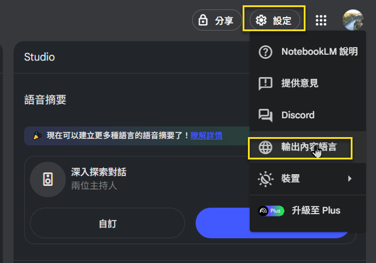
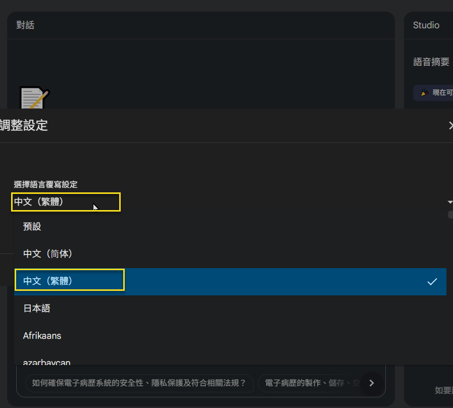
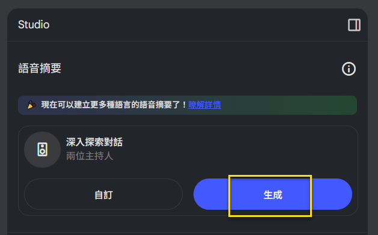
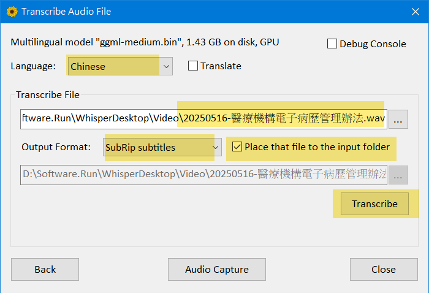
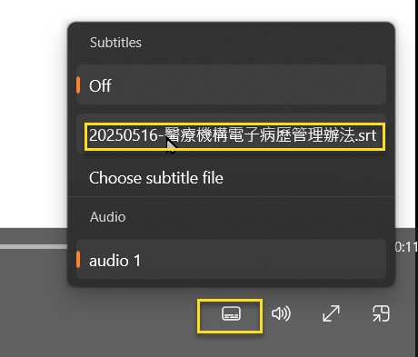
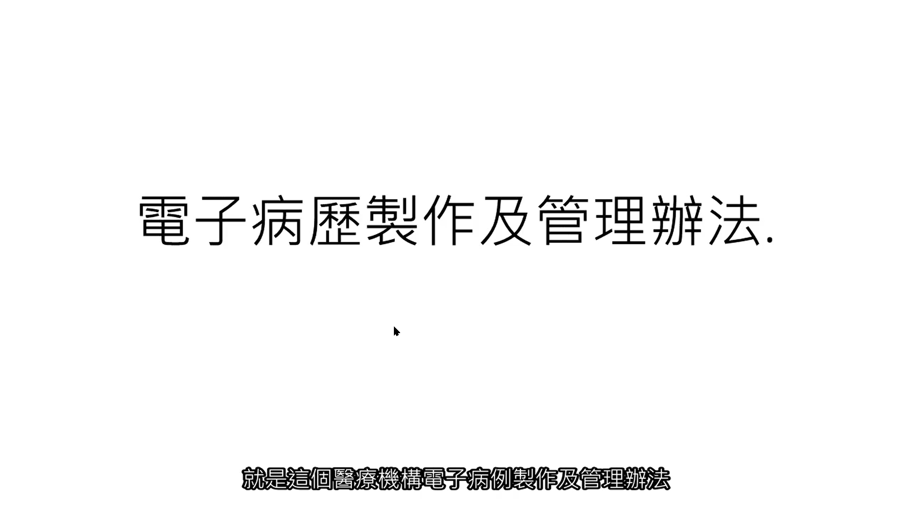

# 初探 NotebookLM + 中文 Vidwo：以 醫療機構電子病歷製作及管理辦法 為例

## 前言

延續前一篇: <a href="https://www.jasperstudy.com/2025/02/notebooklm.html" target="_blank">初探 NotebookLM：以 醫療機構電子病歷製作及管理辦法 為例</a> 有提到 NotebookLM 可以產生 2 位主持人對話的 "語音檔" (Audio). 2025/05 已可產生中文版的對話. 故將前一篇留下的產出 "影音檔" (Video) 的部分, 進行演練.  

依前一篇的內容, 將 醫療機構電子病歷製作及管理辦法.pdf 匯入至 NotebookLM 之後, 即可進行以下步驟.

## 產生中文的 "語音" 對話 (Audio)

### STEP 1: 設定產生中文對話

設定 > 輸出內容語言 > 選擇 中文(繁體)  
  
  

### STEP 2: 生成語音檔

目前只支援產出 .wav 的格式.  
  

### STEP 3: 下載至本機

## 產生字幕檔

雖然 Whisper 有雲端版, 可以使用; 但還是決定用本機版的.  

### STEP 1: 下載 WhisperDesktop 

* <a href="https://github.com/Const-me/Whisper/releases/tag/1.12.0" target="_blank">(GitHub) Whisper Desktop 1.12.0 下載 </a>    

### STEP 2: 下載 WhisperDesktop ggml 模組

選取 ggml-medium.bin 即可.  
* <a href="https://huggingface.co/ggerganov/whisper.cpp/tree/main" target="_blank">(Hugging Face) WhisperDesktop ggml 語言模組 下載</a>

### STEP 3: 安裝

將 WhisperDesktop 下載檔, 解壓縮至固定資料夾下 ( ex: D:\Software.Run\WhisperDesktop\ ), 並將前述 ggml-medium.bin 也複製到同一個資料夾, 這樣就可以執行 WhisperDesktop 了.  

細節可以參考 <a href="https://www.youtube.com/watch?v=-XY_8HWiwno" target="_blank">(影片)(諾特斯) AI 上字幕教學｜OpenAI Whisper 教學｜免費自動字幕 (逐字稿) 生成軟體 WhisperDesktop</a>  

### STEP 4: 製作字幕

* Languaage: Chinese
* Transcribe File: 前述下載的 .wav 檔
* Output Format: .srt
* [v] Place that file to the input folder

  

當然, 字幕還是需要作校對, 但可以用 ChatGPT 輔助, 幫忙找出可能的錯字.  

## 產生中文的 "影音" 對話 (Video)

由於 .wav 不能夠直接搭配 .srt; 必須要有一個靜態的圖片檔 (.png or .jpg), 與 .wav 整合成 .mp4, 才能搭配 .srt 的字幕檔.  

### STEP 1: 產生靜態的 .png

利用 PowerPoint 建立只有第1張投影片的 .pptx 檔; 之後再 [另存新檔], 選取 .png 的輸出格式即可.

  

### STEP 2: 製作 .mp4

利用 ffmpeg 工具, 將 .png 及 .wav 整合, 產出 .mp4 檔案. 
對於指令細節有興趣者, 可以請 ChatGPT 作解釋.  

```bash
ffmpeg -loop 1 -i 電子病歷製作及管理辦法.png -i 20250516-醫療機構電子病歷管理辦法.wav \
       -c:v libx264 -pix_fmt yuv420p \
       -c:a aac -b:a 192k \
       -shortest 20250516-醫療機構電子病歷管理辦法.mp4
```

### STEP 3: 播放 .mp4

Windows 系統有內建 Windowds Media Player 可以播放, 但預設不會開啟 .srt 檔, 要自行作設定.  

  

## 將字幕內嵌於影片 (軟字幕)

播放時要額外設定 Windows Media Player 的字幕檔, 看來有點麻煩.  
或許, 可以考慮把字幕內嵌於影片; 把 .srt 變成檔案內的獨立字幕軌.  

注意: Windows Media Player 對內嵌字幕支援極差; 經實測, 以下指令產出的 .mkv 檔, 在 Windows Media Player 是看不到字幕的. 可改為直接燒錄硬字幕.  

```bash
ffmpeg -i 20250516-醫療機構電子病歷管理辦法.mp4 \
       -i 20250516-醫療機構電子病歷管理辦法.srt \
       -c copy 20250516-醫療機構電子病歷管理辦法.mkv
```

## 將字幕內嵌於影片 (硬字幕)

指令如下:  

```bash
ffmpeg -i 20250516-醫療機構電子病歷管理辦法.mp4 \
       -vf "subtitles=20250516-醫療機構電子病歷管理辦法.srt" \
       -c:v libx264 -crf 18 -preset medium \
       -c:a copy 20250516-醫療機構電子病歷管理辦法-硬字幕.mp4
```

播放截圖如下:

  

## 結論

NotebookLM 可以支援產生中文 "語音", 真的很不錯, 如果可以直接產生 "影音" + "字幕" 的話, 會更好.  

這整個過程中, 最複雜的是 ffmpeg 的指令參數, 還好有 ChatGPT 幫忙, 才得以順利完成.  

文中的 ffmpeg 指令, 如果有疑義, 也可以問 ChatGPT.  

## 參考文件

* <a href="https://law.moj.gov.tw/LawClass/LawAll.aspx?pcode=L0020121" target="_blank">(全國法規資料庫) 醫療機構電子病歷製作及管理辦法</a>  

* <a href="https://www.bnext.com.tw/article/81728/notebooklm-tutorial" target="_blank">(數位時代) NotebookLM教學｜NotebookLM是什麼？如何快速消化大量文本、生成摘要？</a>  

* <a href="https://www.youtube.com/watch?v=C6XS8WM_Ias" target="_blank">(影片)(雲云工作室) (Youtube)  NotebookLM 語音轉文字逐字稿</a>  
> 2025.05 起, 已支援產生 中文語音 對話

* <a href="https://www.youtube.com/watch?v=-XY_8HWiwno" target="_blank">(影片)(諾特斯) AI 上字幕教學｜OpenAI Whisper 教學｜免費自動字幕 (逐字稿) 生成軟體 WhisperDesktop</a>  

* <a href="https://vocus.cc/article/64701a2cfd897800014daed0" target="_blank">(DAN) FFMPEG 安裝教學(windows)</a>  

* <a href="https://blog.miniasp.com/post/2022/10/08/Useful-tool-FFmpeg" target="_blank">(Will 保哥) 介紹好用工具：FFmpeg (強大的錄影、轉檔、串流工具與函式庫)</a>  


